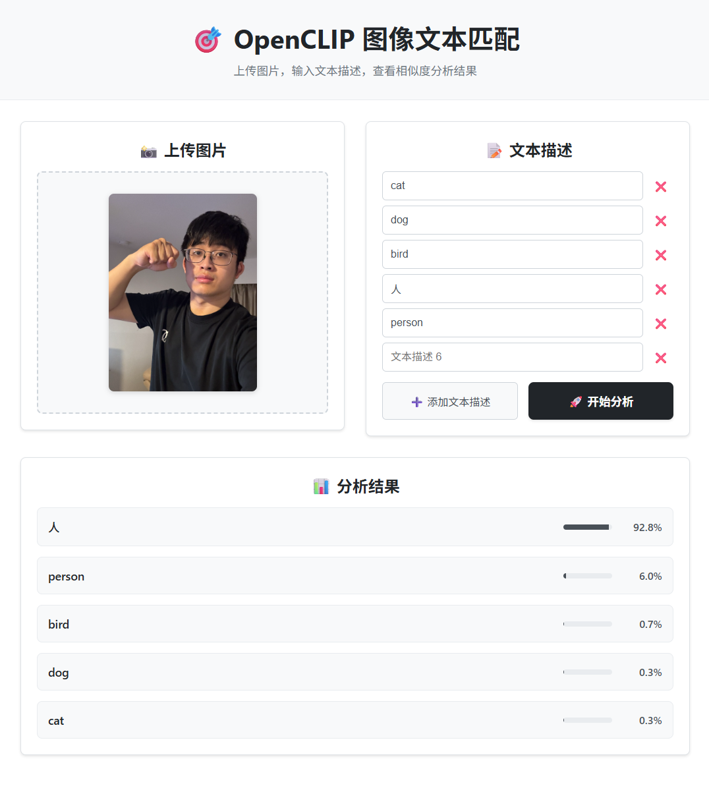

# React Vision - OpenCLIP 图像文本匹配项目

这是一个基于OpenCLIP的图像文本匹配应用，包含React前端和Flask后端。用户可以上传图片并输入文本描述，系统会分析图片与文本的相似度。

## 效果



## 功能特点

### 📊 图片分析模式
- 🖼️ **图像上传**：支持拖拽或点击上传图片
- 📝 **文本描述**：可添加多个文本描述进行匹配
- 🎯 **相似度分析**：基于OpenCLIP模型计算图像与文本的相似度
- 📊 **结果可视化**：以进度条形式展示匹配结果

### 🔍 图片搜索模式
- 📁 **批量上传**：支持同时上传多张图片
- 🔍 **文本搜索**：输入文本描述，从图片集合中找出最匹配的图片
- 🏆 **智能排序**：按相似度自动排序搜索结果
- 🎨 **可视化展示**：网格布局展示搜索结果，直观显示匹配度

### 🎨 通用特性
- 🔄 **模式切换**：在图片分析和图片搜索模式间自由切换
- 🎨 **现代化界面**：简洁美观的React界面设计
- 📱 **响应式设计**：支持移动端和桌面端访问

## 技术栈

- **前端**：React, CSS3
- **后端**：Flask, Python
- **AI模型**：OpenCLIP
- **图像处理**：PIL (Python Imaging Library)

## 使用场景

### 图片分析模式
适用于分析单张图片与多个文本描述的匹配程度，例如：
- 图片内容识别和分类
- 图片标签生成
- 内容审核和筛选

### 图片搜索模式
适用于从大量图片中快速找到符合描述的图片，例如：
- 图片库管理和检索
- 电商商品图片搜索
- 素材库内容查找
- 相册智能分类

## 安装与运行

### 后端设置

1. 安装Python依赖：
```bash
pip install flask flask-cors torch torchvision open_clip_torch pillow safetensors
```

2. 启动Flask后端：
```bash
python main.py
```
后端将在 http://localhost:5000 运行

### 前端设置

1. 进入web目录：
```
cd web
```
2. 安装依赖：
```
npm install
```
3. 启动React应用：
```
npm start
```
前端将在 http://localhost:3000 运行